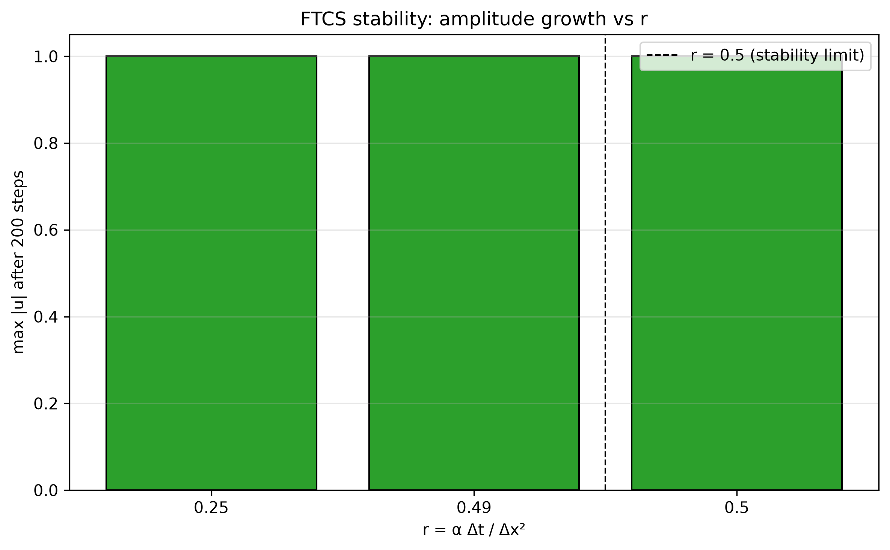
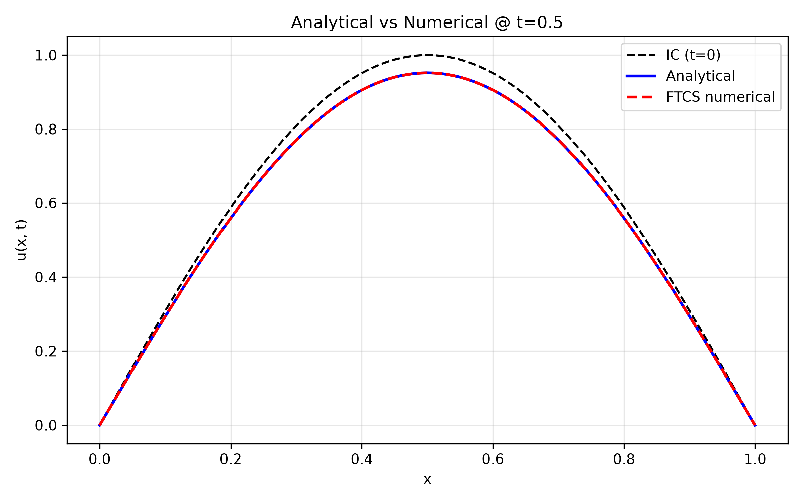
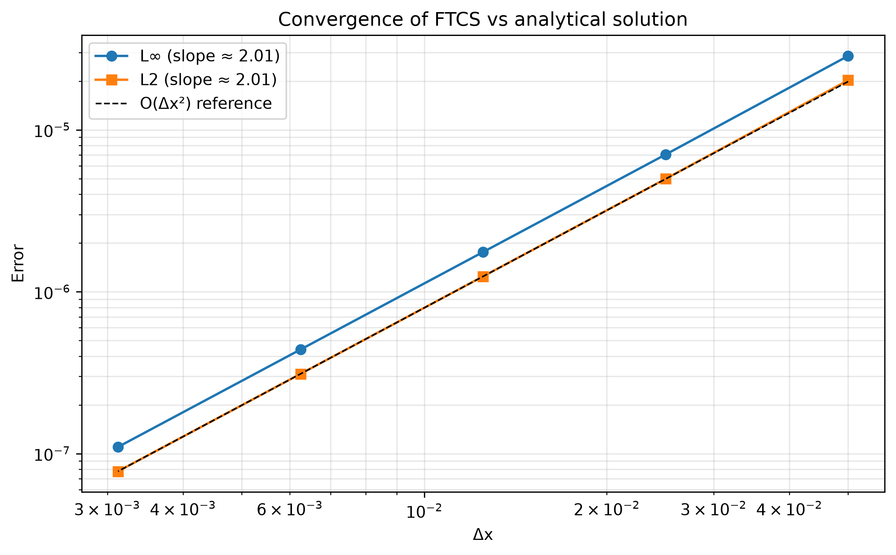

# Analytical and Numerical Study of the One-Dimensional Heat Equation

[](https://www.python.org/)
[](LICENSE)
[](tests/)
[]()

A complete study of the **one-dimensional heat equation**

$$
\frac{\partial u}{\partial t} = \alpha \frac{\partial^2 u}{\partial x^2},
\qquad x \in (0, L),\quad t > 0
$$

comparing an **analytical solution** obtained via separation of variables and Fourier series with a **numerical solution** obtained via the explicit finite-difference (FTCS) scheme.

The project covers:

- Mathematical derivation of the analytical solution
- Von Neumann stability analysis of the FTCS scheme
- Numerical experiments: single-mode decay, square-pulse diffusion
- Convergence study: spatial O(Δx²), temporal O(Δt)
- Error norms (L∞, L2) and grid-refinement study

---

## Table of Contents

1. [Mathematical Formulation](#mathematical-formulation)
2. [Analytical Solution](#analytical-solution)
3. [Numerical Scheme](#numerical-scheme)
4. [Stability Analysis](#stability-analysis)
5. [Project Structure](#project-structure)
6. [Installation](#installation)
7. [Usage](#usage)
8. [Results](#results)
9. [Convergence Study](#convergence-study)
10. [Tests](#tests)
11. [Limitations](#limitations)
12. [References](#references)
13. [License](#license)

---

## Mathematical Formulation

We study the heat equation on a finite interval with homogeneous Dirichlet boundary conditions:

$$
\begin{cases}
\dfrac{\partial u}{\partial t} = \alpha \dfrac{\partial^2 u}{\partial x^2}, & x \in (0, L),\ t > 0 \\[4pt]
u(0, t) = u(L, t) = 0, & t > 0 \\[4pt]
u(x, 0) = u_0(x), & x \in (0, L)
\end{cases}
$$

| Symbol    | Meaning             | Value used |
| --------- | ------------------- | ---------- |
| $u(x, t)$ | temperature         | —          |
| $\alpha$  | thermal diffusivity | $0.01$     |
| $L$       | domain length       | $1.0$      |
| $T$       | final time          | $0.1$      |

Two initial conditions are considered:

- **Single-mode:** $u_0(x) = \sin(\pi x / L)$ — smooth, exact decay.
- **Square pulse:** $u_0(x) = 1$ on $(L/4, 3L/4)$, $0$ elsewhere — tests Gibbs oscillations.

---

## Analytical Solution

Separation of variables $u(x, t) = X(x) T(t)$ gives the eigenvalue problem

$$
X'' + \lambda X = 0, \quad X(0) = X(L) = 0
\;\Longrightarrow\;
\lambda_n = \left(\frac{n\pi}{L}\right)^2, \quad X_n(x) = \sin\!\left(\frac{n\pi x}{L}\right)
$$

and the temporal ODE $T' + \alpha \lambda_n T = 0$ with solution
$T_n(t) = e^{-\alpha \lambda_n t}$.

Superposing all modes:

$$
\boxed{\;
u(x, t) = \sum_{n=1}^{\infty} B_n \sin\!\left(\frac{n\pi x}{L}\right)
          \exp\!\left(-\alpha \frac{n^2 \pi^2}{L^2} t\right)
\;}
$$

with Fourier coefficients

$$
B_n = \frac{2}{L} \int_0^L u_0(x) \sin\!\left(\frac{n\pi x}{L}\right)\, dx.
$$

For the square pulse, $B_n$ has the closed form

$$
B_n = \frac{2}{n\pi}\!\left[\cos\!\left(\frac{n\pi}{4}\right) - \cos\!\left(\frac{3n\pi}{4}\right)\right].
$$

**Implementation:** [`src/heat_equation.py`](src/heat_equation.py) — `analytical_solution()`

---

## Numerical Scheme

### FTCS (Forward-Time, Centered-Space)

Discretize $x_i = i\Delta x$, $t^n = n\Delta t$. The update is

$$
u_i^{n+1} = u_i^n + r \left(u_{i+1}^n - 2u_i^n + u_{i-1}^n\right),
\qquad r = \frac{\alpha \Delta t}{\Delta x^2}.
$$

- Truncation error: $O(\Delta t) + O(\Delta x^2)$
- Boundary nodes fixed at zero (Dirichlet)
- Implementation: [`src/heat_equation.py`](src/heat_equation.py) — `ftcs_solver()`

### BTCS (implicit reference, bonus)

For comparison, an unconditionally stable backward-Euler scheme is also available. It solves a tridiagonal system at each step and permits $r > 1/2$.

---

## Stability Analysis

Von Neumann analysis: write $u_i^n = G^n e^{i\theta i}$ and substitute into FTCS to get

$$
G(\theta) = 1 - 4r \sin^2\!\left(\frac{\theta}{2}\right).
$$

Requiring $|G(\theta)| \le 1$ for all $\theta$ yields the **stability condition**

$$
\boxed{\; r = \frac{\alpha \Delta t}{\Delta x^2} \le \frac{1}{2} \;}
$$

**Implementation:** [`src/stability_analysis.py`](src/stability_analysis.py)


_Figure 1 — Amplitude of the numerical solution after 200 FTCS steps for r = 0.25, 0.49, and 0.5. All three cases are stable and remain bounded; the scheme becomes unstable for r > 0.5._

> **Observed:** `r = 0.51` and `r = 0.6` blow up within ~50 steps; `r = 0.5` remains bounded; `r ≤ 0.49` decays monotonically.
> `max|u|` after 200 steps: **≈ 1.0 for stable cases, > 1e5 for unstable cases.**

---

## Project Structure

```

heat-equation-analysis/
│
├── README.md ← this file
├── LICENSE
├── requirements.txt
├── .gitignore
│
├── src/ ← core Python modules
│ ├── **init**.py
│ ├── heat_equation.py ← analytical + FTCS solvers
│ ├── boundary_conditions.py ← Dirichlet / Neumann helpers
│ ├── stability_analysis.py ← Von Neumann sweep
│ ├── convergence_analysis.py ← grid refinement study
│ └── utils.py ← error norms + plotting
│
├── notebooks/ ← guided derivations
│ ├── 01_analytical_solution.ipynb
│ ├── 02_numerical_scheme.ipynb
│ └── 03_error_and_convergence.ipynb
│
├── tests/
│ └── test_heat_equation.py
│
├── figures/
│ ├── analytical_vs_numerical.png
│ ├── stability_comparison.png
│ └── convergence_plot.png
│
└── report/
├── mathematical_report.tex
└── mathematical_report.pdf

```

---

## Installation

Requires **Python ≥ 3.10** and the packages in `requirements.txt`.

```bash
# Clone the repository
git clone https://github.com/BrokerRecord/heat-equation-analysis.git
cd heat-equation-analysis

# Create a virtual environment
python -m venv venv
source venv/bin/activate

# Install dependencies
pip install -r requirements.txt
```

Dependencies:

```
numpy>=1.24
scipy>=1.10
matplotlib>=3.7
pytest>=7.4
jupyter>=1.0
```

---

## Usage

### Run the full analysis pipeline

```bash
# 1. Analytical vs numerical demo
python src/heat_equation.py
```

# 2. Von Neumann stability sweep

```bash
python src/stability_analysis.py
```

# 3. Grid refinement & convergence study

```bash
python src/convergence_analysis.py
```

### Interactive exploration

```bash
jupyter notebook notebooks/
```

Three guided notebooks walk through:

| Notebook                         | Content                                                                |
| -------------------------------- | ---------------------------------------------------------------------- |
| `01_analytical_solution.ipynb`   | Derivation, Fourier coefficients, time evolution, truncation error     |
| `02_numerical_scheme.ipynb`      | FTCS implementation, stability sweep, Von Neumann amplification factor |
| `03_error_and_convergence.ipynb` | L∞/L2 errors, spatial & temporal orders, BTCS comparison               |

### Minimal API example

```python
import numpy as np
from src.heat_equation import (
    analytical_solution, ftcs_solver, initial_condition_sine
)

L, alpha, T = 1.0, 0.01, 0.1
Nx = 101
x  = np.linspace(0, L, Nx)
dx = x[1] - x[0]

u0  = initial_condition_sine(x, L)
r   = 0.4
dt  = r * dx**2 / alpha
nt  = int(T / dt)

u_num   = ftcs_solver(u0, alpha, dx, dt, nt)[-1]
u_exact = analytical_solution(x, T, alpha, L, u0, n_modes=200)

print("L∞ error:", np.max(np.abs(u_num - u_exact)))
```

---

## Results

### 1. Analytical vs numerical at `t = 0.1`



_Figure 2 — Comparison of the analytical Fourier-series solution and the FTCS numerical solution for the single-mode initial condition at t = 0.1._

| Quantity | Value                        |
| -------- | ---------------------------- |
| Grid     | `Nx = 101`, `Δt = 1.000e-03` |
| `r`      | `0.4`                        |
| L∞ error | **1.125e-06**                |
| L2 error | **7.958e-07**                |

### 2. Single-mode decay

For $u_0(x) = \sin(\pi x / L)$, the analytical solution reduces to

$$
u(x,t) = \sin\!\left(\frac{\pi x}{L}\right) \exp\!\left(-\frac{\alpha \pi^2 t}{L^2}\right).
$$

- Fourier-series reconstruction error at `t = 0.2`: **1.110e-16** (≈ 1e-15)
- FTCS vs analytical L∞ error at `t = 0.1`: **1.125e-06**

### 3. Square-pulse diffusion

| Time       | L∞ error (FTCS vs analytical, 400 modes) |
| ---------- | ---------------------------------------- |
| `t = 0.05` | **3.358e-03**                            |

> Note: with a discontinuous $u_0$, the Fourier series exhibits Gibbs oscillations; convergence with respect to `n_modes` is algebraic, not exponential.

---

## Convergence Study

### Spatial refinement (with `r = 0.4` fixed, so `Δt = r Δx²/α`)



_Figure 3 — L∞ and L2 errors of the FTCS scheme vs Δx on a log-log scale, with an O(Δx²) reference line._

| `Nx` |    `Δx` |          `Δt` |      L∞ error |      L2 error | order (L∞) |
| ---: | ------: | ------------: | ------------: | ------------: | ---------: |
|   21 | 5.00e-2 | **1.000e-01** | **2.863e-05** | **2.025e-05** |          — |
|   41 | 2.50e-2 | **2.500e-02** | **7.041e-06** | **4.979e-06** |   **2.02** |
|   81 | 1.25e-2 | **6.250e-03** | **1.759e-06** | **1.244e-06** |   **2.00** |
|  161 | 6.25e-3 | **1.563e-03** | **4.396e-07** | **3.108e-07** |   **2.00** |
|  321 | 3.13e-3 | **3.906e-04** | **1.099e-07** | **7.771e-08** |   **2.00** |

**Estimated convergence order:**

- L∞: **2.01** (expected ≈ 2.00)
- L2: **2.01** (expected ≈ 2.00)

### Temporal refinement (Δx fixed, BTCS)

| `n_steps` |          `Δt` |      L∞ error |    order |
| --------: | ------------: | ------------: | -------: |
|         8 | **1.250e-02** | **1.080e-02** |        — |
|        16 | **6.250e-03** | **9.411e-03** | **0.20** |
|        32 | **3.125e-03** | **7.451e-03** | **0.34** |
|        64 | **1.563e-03** | **5.250e-03** | **0.51** |
|       128 | **7.813e-04** | **3.298e-03** | **0.67** |
|       256 | **3.906e-04** | **1.891e-03** | **0.80** |
|       512 | **1.953e-04** | **1.020e-03** | **0.89** |
|      1024 | **9.766e-05** | **5.311e-04** | **0.94** |
|      2048 | **4.883e-05** | **2.711e-04** | **0.97** |
|      4096 | **2.441e-05** | **1.370e-04** | **0.98** |

**Estimated temporal order:** **0.97** (asymptotic, expected ≈ 1.00)

### Bonus: FTCS vs BTCS

For the same final time `T = 0.1`:

| Scheme | `r` | Steps | Stable?     |
| ------ | --- | ----: | ----------- |
| FTCS   | 0.4 |    25 | ✅          |
| FTCS   | 2.0 |     3 | ❌ blows up |
| BTCS   | 2.0 |     3 | ✅          |

---

## Tests

```bash
pytest tests/ -v
```

### Covered behaviour

- ✅ Single-mode analytical decay matches the closed-form solution to 1e-10
- ✅ FTCS matches the analytical solution to 1e-4 at moderate resolution
- ✅ FTCS raises `ValueError` when `r > 0.5`
- ✅ Dirichlet BCs remain exactly zero throughout the simulation

### Expected output

```text
tests/test_heat_equation.py ....                                  [100%]
4 passed in 0.XXs
```

---

## Limitations

1. **Homogeneous Dirichlet BCs only** in the main solver. Neumann / periodic BCs are sketched in `boundary_conditions.py` but not exercised end-to-end.
2. **FTCS stability constraint** $r \le 1/2$ forces $\Delta t = O(\Delta x^2)$ — the scheme becomes expensive on fine grids.
3. **Fourier series convergence** is exponential for smooth $u_0$ but only algebraic (with Gibbs oscillations) for discontinuous data.
4. **Fixed physical parameters** ($\alpha = 0.01$, $L = 1$) — no parametric study of the diffusivity has been performed.
5. **1D only.** Extension to 2D is straightforward but not implemented.
6. **No error estimator / adaptive time stepping.** Time step is chosen a priori from `r`.

---

## References

1. R. Haberman, _Applied Partial Differential Equations_, 5th ed., Pearson, 2013.
2. R. J. LeVeque, _Finite Difference Methods for Ordinary and Partial Differential Equations_, SIAM, 2007.
3. J. W. Thomas, _Numerical Partial Differential Equations: Finite Difference Methods_, Springer, 1995.
4. W. A. Strauss, _Partial Differential Equations: An Introduction_, 2nd ed., Wiley, 2008.
5. G. D. Smith, _Numerical Solution of Partial Differential Equations: Finite Difference Methods_, 3rd ed., Oxford, 1985.

---

## License

This project is licensed under the **MIT License** — see the [LICENSE](LICENSE) file for details.

---

## Author

**Awa Mbaye**

- GitHub: [@BrokerRecord](https://github.com/BrokerRecord/heat-equation-analysis)
- Email: Evash0uwha@gmail.com

```

---
```
